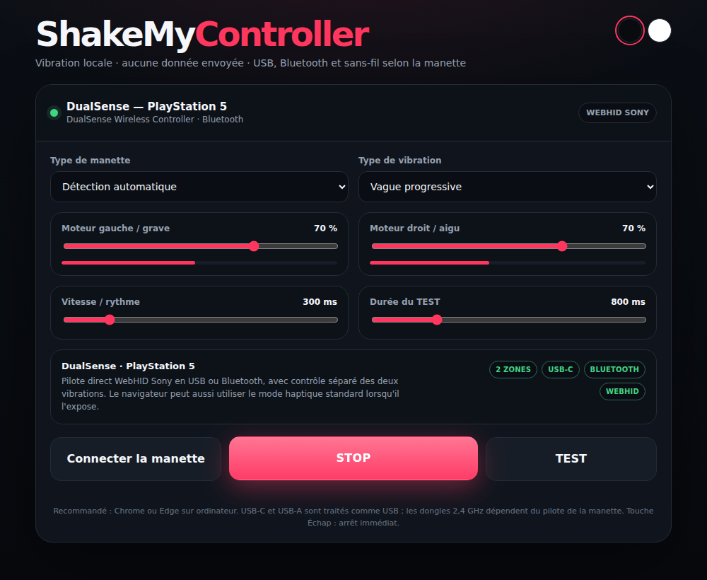

# 🎮 ShakeMyController

[](https://github.com/cdqp/ShakeMyController/actions/workflows/ci.yml)

**ShakeMyController** is a lightweight, self-contained web page to test, control and trigger haptic rumble on game controllers directly from your browser.

Everything runs locally: a single HTML file, no dependencies, no network requests, and no data ever leaves your machine.

**[▶️ Open it online](https://cdqp.github.io/ShakeMyController/)** · **[⬇️ Download ShakeMyController.html](https://github.com/cdqp/ShakeMyController/raw/main/ShakeMyController.html)**



## ✨ Features

### 🔌 Multi-protocol support
- **Gamepad API haptics** (`dual-rumble`, and `trigger-rumble` when the browser exposes it), with no permission prompt.
- **Direct WebHID control** for Sony and Nintendo hardware, over USB or Bluetooth.

### 🎮 Controller compatibility

| Family | Models | Path |
| --- | --- | --- |
| PlayStation | DualSense (PS5), DualSense Edge, DualShock 4 (PS4) | Sony WebHID (USB & Bluetooth, CRC32 signed reports) or Gamepad API |
| Nintendo | Switch Pro Controller, Joy-Con (L/R) | Nintendo WebHID with HD Rumble (low & high frequency) |
| Xbox & PC | Xbox Wireless, Xbox Elite Series 2, 8BitDo, Razer Wolverine, SCUF Envision Pro… | Gamepad API / XInput, optional Impulse Triggers |

Controllers are identified by USB vendor/product ID, with a name-based fallback. Controllers without a rumble motor (e.g. Logitech F310) are detected and reported as such.

### 🌊 Vibration patterns
Continuous · Pulses · Heartbeat · Left/Right alternating · Progressive wave · Ramp up · Random

### 🎛️ Precision tuning
- Independent power sliders for the left (heavy / low frequency) and right (light / high frequency) motors, with live output meters.
- Adjustable rhythm interval and quick-test duration.
- HD Rumble frequency controls (Hz) for Nintendo hardware.
- Settings and theme are remembered between visits.

### 🌓 Interface
Dark / light themes (follows the system preference by default), responsive desktop and mobile layout, keyboard accessible. Press **Esc** to stop any vibration immediately.

## 🚀 Usage

1. Open the [online version](https://cdqp.github.io/ShakeMyController/) or the downloaded `ShakeMyController.html` in **Google Chrome** or **Microsoft Edge** (desktop).
2. Turn the controller on and press any button on it.
3. Click **Connecter la manette** and, if prompted, pick your controller in the WebHID dialog.
4. Use **SHAKE** for the selected pattern, or **TEST** for a short burst.

WebHID requires a secure context. If opening the file directly does not work, serve it locally:

```sh
python3 -m http.server 8000
# then open http://localhost:8000/ShakeMyController.html
```

## 🧰 Requirements
- **Browser:** Chrome or Edge (desktop) for full WebHID support. Other browsers are limited to the Gamepad API.
- **Connection:** USB cable, Bluetooth, or 2.4 GHz adapter, depending on what the OS driver exposes.
- **Security context:** HTTPS or `localhost`.

## 🛠️ Built with
- HTML5 and plain CSS3 (custom properties, responsive layout, theme switching)
- Vanilla JavaScript, zero external dependencies
- Web APIs: Gamepad API (haptic actuators) and WebHID (raw output reports, CRC32 for Sony Bluetooth)

## 🧪 Development

The app stays a single dependency-free HTML file. Node.js is only used for the test suite:

```sh
npm install
npx playwright install chromium
npm test
```

The tests check the protocol encoders (Sony reports and CRC32, Nintendo HD Rumble, controller identification) and drive the page end to end with simulated Gamepad API and WebHID controllers. They run on every push and pull request.

See [CONTRIBUTING.md](CONTRIBUTING.md) to report a controller or add support for a new one, and [CHANGELOG.md](CHANGELOG.md) for release notes.
